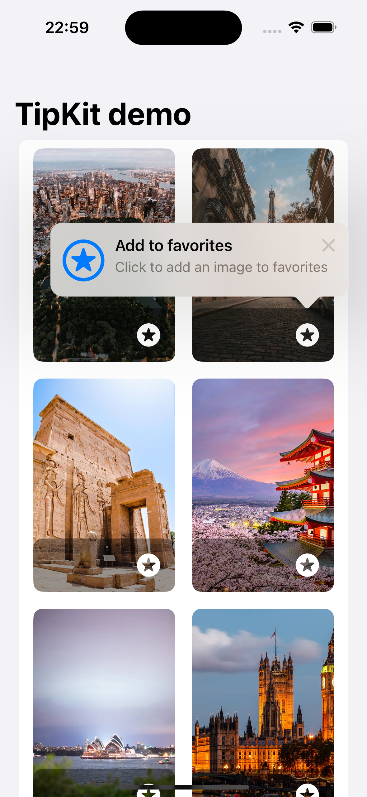

#### ℹ️ TipKit

<br>

Demonstration of use of the new component for displaying directions in apps with swiftui introduced in iOS 17: TipKit

##### Apple documentation: <a>https://developer.apple.com/documentation/TipKit</a>


The first thing to do is to create a struct that complies with the Tip protocol.

```Swift
import TipKit

struct FavoriteTip: Tip {
    var title: Text {
        Text("Add to favorites")
    }

    var message: Text? {
        Text("Click to add an image to favorites")
    }

    var image: Image? {
        Image(systemName: "star.circle")
    }
}
``````

Title, text and message are the minimum values to provide, but there are others to further customize the component. For example:

```Swift
    /// Buttons that help people get started or learn more about your feature.
    ///
    /// Use actions to provide primary and secondary buttons to help people get started or learn more
    /// about your feature. If you don't supply a value, this property returns an empty array of type `Action`.
    @Tips.ActionBuilder var actions: [Self.Action] { get }

    /// The rules that determine when a tip is eligible for display.
    /// For more information on rules, see ``Tips/Rule``.
    ///
    /// Use this property to define the rules for when your tips display.
    /// If you don't supply a value, this property returns an empty array of type `Rule`.
    @Tips.RuleBuilder var rules: [Self.Rule] { get }

    /// Customizations for a tip.
    @Tips.OptionsBuilder var options: [TipOption] { get }
```

In the view we can instantiate this Tip object:

```Swift
var favoriteTip = FavoriteTip()
``````

and with the popoverTip method, display it on a view, passing it this object and configuring from which side to display it.

```Swift
.popoverTip(favoriteTip, arrowEdge: .bottom, action: {_ in })
```

Finally, it is necessary to make a configuration when loading the view:

```Swift
.task {
    try? Tips.configure([
        .displayFrequency(.immediate),
        .datastoreLocation(.applicationDefault)
    ])
}
``````

To indicate the frequency with which this tip is displayed, the following values are available:

```Swift
/// An immediate display frequency.
///
/// When you set this, the system shows tips with no limitations on frequency.
public static var immediate: Tips.ConfigurationOption.DisplayFrequency { get }

/// A hourly display frequency.
///
/// When you set this, the system shows no more than one tip per hour.
public static var hourly: Tips.ConfigurationOption.DisplayFrequency { get }

/// A daily display frequency.
///
/// When you set this, the system shows no more than one tip per day.
public static var daily: Tips.ConfigurationOption.DisplayFrequency { get }

/// A weekly display frequency.
///
/// When you set this, the system shows no more than one tip per week.
public static var weekly: Tips.ConfigurationOption.DisplayFrequency { get }

/// A monthly display frequency.
///
/// When you set this, the system shows no more than one tip per month.
public static var monthly: Tips.ConfigurationOption.DisplayFrequency { get }
``````